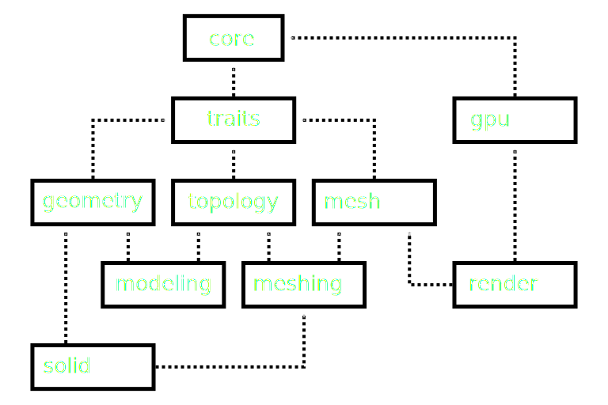

# truck - Truck is a rust CAD kernel

## Overview
Truck is an open-source shape processing kernel by Rust.  
The broad concept consists of the following three elements.
 - Trendy Tools
 - Traditional Arts
 - Theseus' ship

### Trendy Tools
 - We are targeting the next generation of market share using developmental tools: Rust and WebGPU.
 - Advanced optimizations using Rust and WebGPU maximize the performance of each crate.

### Traditional Arts
 - We will break away from the legacy by re-implementing the B-rep with NURBS in the above trendy tools.
 - Safe implementation using Rust to eliminate core dumped for CPU-derived processes.
 - Cargo's extensive maintenance features ensure thorough continuous integration.

### Theseus' ship
 - We are modularizing into smaller crates that can be replaced, like [the Ship of Teseus](https://en.wikipedia.org/wiki/Ship_of_Theseus).
 - Based on the many lessons learned in the past, we have given up on overall optimization as a single application, and design as a collection of individual optimized crates.
 - Since unexpected expansions are bound to occur, we deal with uncontrolled expansions in the form of small modules.

## License
Apache License 2.0

## Usage
### Dependencies
The dev-dependencies of the following crate includes [CMake](https://cmake.org).
 - truck-rendimpl
 - truck-platform
 - truck-modeling

### How to Run Examples
All examples are located under the examples directory in each crates.  
These examples use the default syntax for running examples, as found in the [Cargo](https://doc.rust-lang.org/cargo/reference/cargo-targets.html#examples) documentation.

At first, let's run the following example!
```bash
cargo run --example rotate-objects
```

## crates
### truck-base &emsp; [](https://crates.io/crates/truck-base) [](https://docs.rs/truck-base)
basic structs and traits: importing cgmath, curve and surface traits, tolerance, etc...
### truck-geometry &emsp; [](https://crates.io/crates/truck-geometry) [](https://docs.rs/truck-geometry)
geometrical structs: knot vector, B-spline and NURBS
### truck-topology &emsp; [](https://crates.io/crates/truck-topology) [](https://docs.rs/truck-topology)
topological structs: vertex, edge, wire, face, shell, and solid
### truck-polymesh &emsp; [](https://crates.io/crates/truck-polymesh) [](https://docs.rs/truck-polymesh)
defines polygon data structure and some algorithms handling mesh, including meshing the shapes
### truck-modeling [](https://crates.io/crates/truck-modeling) [](https://docs.rs/truck-modeling)
integrated modeling algorithms by geometry and topology
### truck-platform [](https://crates.io/crates/truck-platform) [](https://docs.rs/truck-platform)
graphic utility library based on wgpu
### truck-rendimpl [](https://crates.io/crates/truck-rendimpl) [](https://docs.rs/truck-rendimpl)
visualization of shape and polygon mesh based on platform


