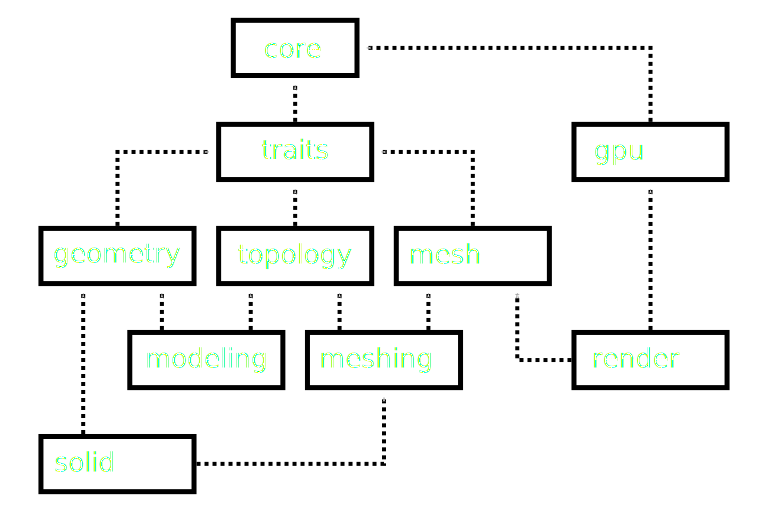

# `monstertruck` — **M**ultifarious **O**mnificence, **N**omenclature **S**tandardized, **T**erminology **E**nhanced & **R**efactored **Truck** — a **Ru**st **C**ad **K**ernel).

## Overview

`monstertruck` is an open-source, Rust-based shape processing kernel. It is a heavily fortified, feature-expanded fork of the original [`truck`](https://github.com/ricosjp/truck) project.

The underlying philosophy of this kernel rests on three foundational pillars:

- **Modern Tooling** We are building the next generation of CAD utilizing modern, cutting-edge tools: Rust and WebGPU. By leveraging advanced, crate-level optimizations in both languages, we maximize performance across both the CPU and the GPU.
- **Classical Techniques, Reborn** We are breaking away from fragile, legacy C++ codebases by fully re-implementing classic Boundary Representation (B-rep) and NURBS from the ground up. Rust's strict memory safety completely eliminates the CPU-level core dumps that plague older CAD software, while Cargo's robust ecosystem provides a seamless foundation for continuous integration.
- **The Ship of Theseus Architecture** Learning from the pitfalls of monolithic CAD architectures, we abandoned the idea of a single, massive application. Instead, we modularized the kernel into a collection of small, highly optimized, and interchangeable crates — much like the Ship of Theseus. Knowing that feature creep and expansions are inevitable, we manage complexity by keeping our modules strictly focused and self-contained.

## Why Was This Forked?

Getting PRs accepted upstream was proving to be a challenge, so we spun up `monstertruck` to keep development moving and add some serious horsepower.

This fork exists to accomplish two main goals:

1. **Supercharge the functionality:** We are actively adding and enhancing features, tools, and operations that go beyond the original scope (hence the _Multifarious Omnificence_).
2. **Fix the ergonomics:** The original codebase suffered from unconventional phrasing, non-idiomatic naming conventions, and occasionally confusing translationsp.
   We have overhauled the project using idiomatic Rust naming conventions and standard, industry-recognized CAD terminology. Our goal is to make the codebase highly inclusive, readable, and accessible—whether you are a non-native English speaker, a Rust fanatic, or a seasoned CAD veteran.

## Usage

### Running the Examples

All examples are located under the `examples` directory within each respective crate. They use standard Cargo syntax for execution.

To test-drive `monstertruck` and render your first object, run the following commands:

```bash
# Clone the required submodules
git submodule update --init

# Run the basic rotation example
cargo run --example rotate-objects
```

## Architecture & Crate Ecosystem

The `monstertruck` kernel is split into independent crates so you only need to pull in what you need (and also to help with build times).

### Core & Geometry

- [`monstertruck-core`](monstertruck-core/) — Core types and traits for linear algebra, curves, surfaces, and tolerances.
- [`monstertruck-derive`](monstertruck-derive/) — Derive macros for geometric traits.
- [`monstertruck-traits`](monstertruck-traits/) — Geometric trait definitions.
- [`monstertruck-geometry`](monstertruck-geometry/) — Geometric primitives: knot vectors, B-splines, NURBS, and T-splines.

### Topology & Modeling

- [`monstertruck-topology`](monstertruck-topology/) — Topological data structures: vertices, edges, wires, faces, shells, and solids.
- [`monstertruck-modeling`](monstertruck-modeling/) — Integrated geometric and topological modeling algorithms.
- [`monstertruck-solid`](monstertruck-solid/) — Boolean operations, fillets, and shape healing for solids.
- [`monstertruck-assembly`](monstertruck-assembly/) — Assembly data structures using a directed acyclic graph (DAG).

### Meshing & Rendering

- [`monstertruck-mesh`](monstertruck-mesh/) — Polygon mesh data structures and algorithms.
- [`monstertruck-meshing`](monstertruck-meshing/) — Tessellation and meshing algorithms for B-rep shapes.
- [`monstertruck-gpu`](monstertruck-gpu/) — Graphics utility crate built on wgpu.
- [`monstertruck-render`](monstertruck-render/) — Shape and polygon mesh visualization.

### I/O & Bindings

- [`monstertruck-step`](monstertruck-step/) — STEP file import and export.
- [`monstertruck-wasm`](monstertruck-wasm/) — WebAssembly/JavaScript bindings.



## License

Apache License 2.0
